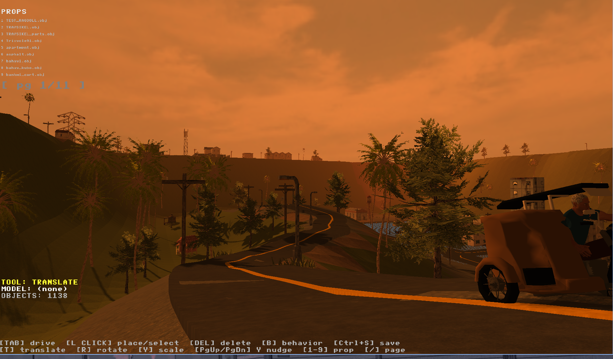
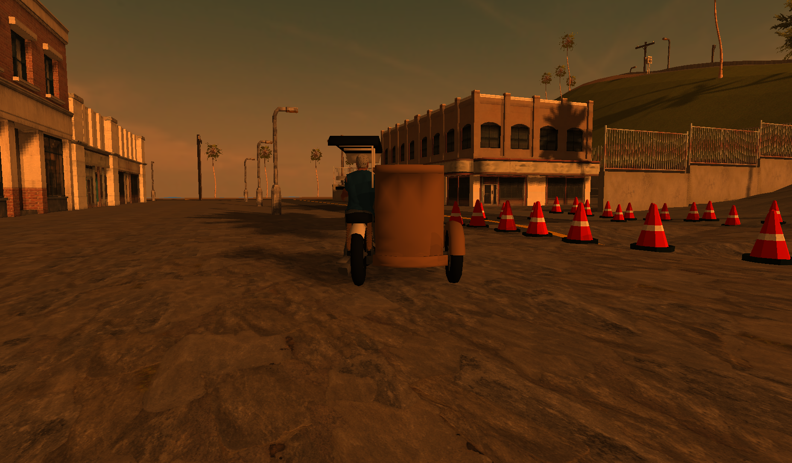
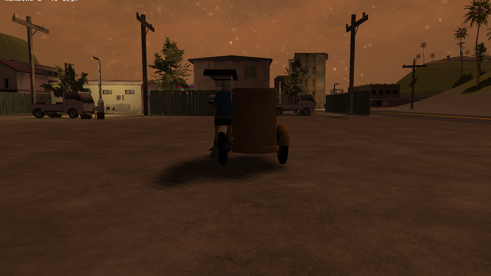
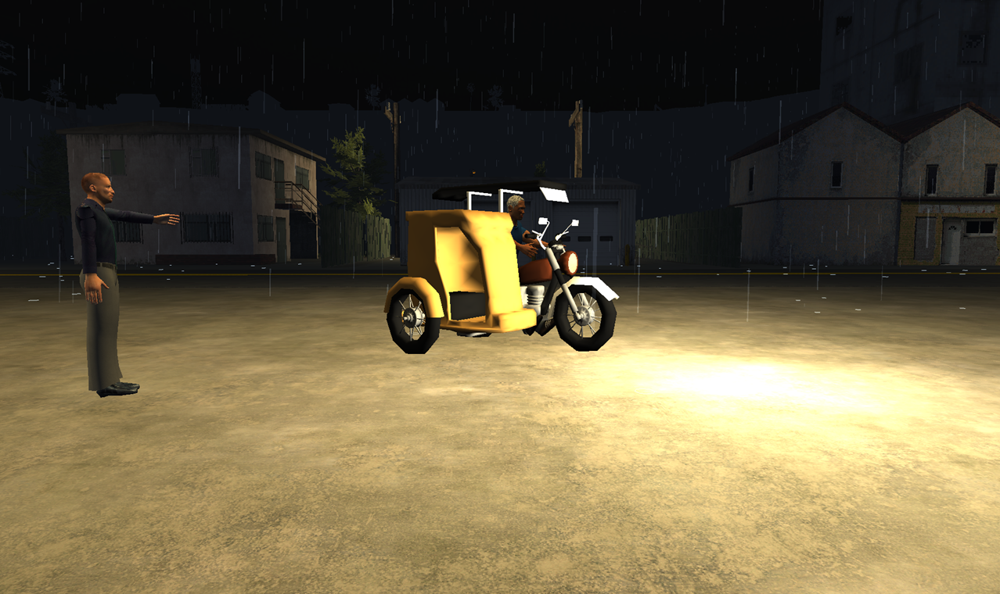
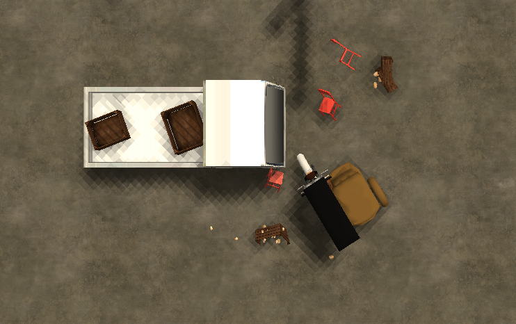
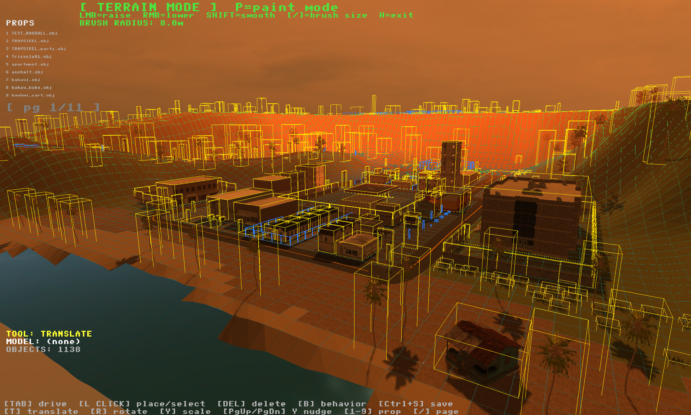
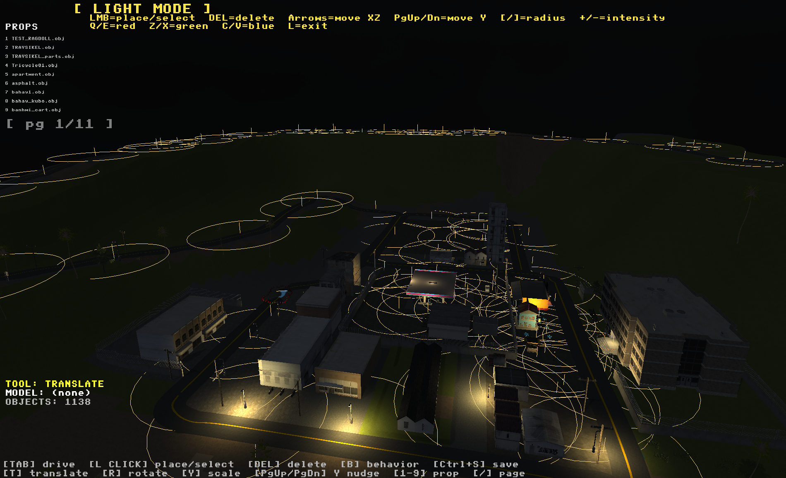
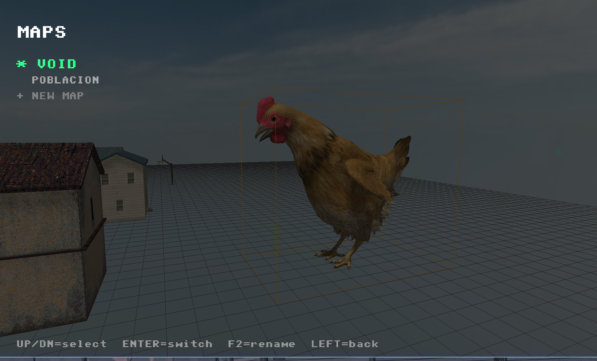
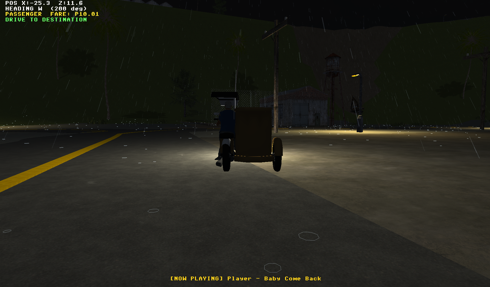
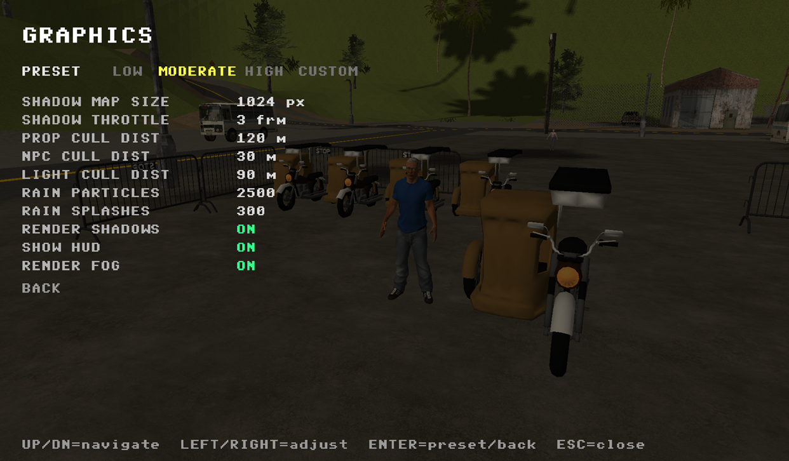

# BYAHENGINE



## About
a 3D simulation engine built in C++ and OpenGL as both a personal learning sandbox for low level graphics programming and a tribute to my dad who's also a tricycle driver. The sandbox environment is inspired by the rural area I actually live in - complete with rough roads,
beaches, and barren hills. Might as well try and simulate my daily commute from scatch.

No game engine. No shortcuts. Just raw OpenGL, a lot of midnight hours, and an
oddly specific premise



## Features

### Renderer



- The renderer is a forward-renderer built on OpenGL 3.3 core profile. Shaders are loaded from .glsl files at runtime so you can tweak them without recompiling

- Mesh pipeline: .obj files are parsed by a custom loader with binary .objcache and .texcache sidecar files

- Shadows: A single directional shadow map using PCF soft shadows

- Day/night cycle: The sun moves along a defined arc. The skybox blends between three equirectangular textures

- Ocean: Vertex-animated sine wave displacement with hash-based noise for variety

- Rain: A particle system of billboard quads that lean into their velocity. Each particle has randomized size, opacity, and speed. A ring buffer of splash pool quads spawns at impact points



- Point lights: Placed per-object via the editor and saved to .lt sidecar files. At runtime, lights within a configurable radius are uploaded to the shader. Night-only lights (streetlamps, windows) are gated by time of day

### Physics
- Trike physics: The tricycle has a custom physics model built around its real geometry - engine torque, gear ratios, wheel radius, suspension, and sidecar asymmetry

- Collision: Every object in the world has an axis-aligned bounding box. Collision is resolved via Minimum Translation Vector (MTV) where trike is pushed out of overlapping objs each frame

- Rigid Body Dynamics - Object stability is modeled with gravity, angular momentum, and a toppling threshold. Needs work though, its still quite goofy.



### Editor
- The editor is a full in-engine tool accessible via TAB key. It runs in the same process as the sim

- Object placement: Place, translate, rotate, and scale objects with mouse and keyboard. Objects are categorized into a paginated prop browser that scans the assets/props/

- Terrain: Height sculpt with raise/lower/flatten brushes. Surface painting assigns audio and visual material types per verts

- Roads: Bezier spline roads with configurable width and segment count. Spline control points snap to terrain height

- Lighting : Place and configure point lights. Set color, intensity, and radius.

- Ambience zones: Place spherical ambience zones, assign audio files, set radius and type.

- Multi-map system: The project supports multiple named maps. Each map lives in its own directory under assets/maps/ with its own object list, terrain, roads, NPC data, and ambience. Switch between maps at runtime







### World & NPCs
- NPCs have a state machine with seven states: IDLE, WALK, HAILING, MOUNTING, PASSENGER, DISMOUNTING, RAGDOLL

- Pedestrians wander between waypoints, play idle chatter audio with proximity gating, and can be knocked into ragdoll by the trike. The ragdoll uses the dynamic sim for physics

- Passenger flow: a pedestrian enters the HAILING state when the trike is near. Press Q to confirm pickup. The NPC mounts the sidecar, a destination marker appears in the world, and a HUD arrow points toward it.

- NPC poses configured via Pose mode in editor

- Animals: A separate animal NPC system with species-specific behavior tables. Animals can graze or flee when the trike approaches. Per-species walk cycle animations driven by procedural sine-wave bone offsets

- Animations: All skeletal animation is procedural sine-wave offsets on named bones, tuned per pose and action. Not pixar. Thats too hard. 



### Settings

- settings.cfg stores runtime config

- Graphics settings: fog toggle, shadow toggle, rain toggle, shadow map resolution. All settings take effect immediately without restart. Shadow map resizing re-allocates the FBO at runtime



## How to Run

**Requirements:** CMake 3.x, a C++17 compiler, OpenGL 3.3+

**Download Dependencies available via Drive Link:** [Google Drive](https://drive.google.com/drive/folders/1HXlKvaPrwI-AJZNiK7k1ehtWSCPX0YoA?usp=drive_link)
- Place `vendor/` in project root → `byahengine/vendor/`
- Place `props/` in assets → `byahengine/assets/props/`
- Place all contents inside `entity/` to -> `byahengine/assets/entity` or simply replace the folder entirely
- Make sure there is no subfolder duplicate layering eg. `assets/props/props/file.obj` should just be -> `assets/props/file.obj`

```bash
git clone https://github.com/SelwynLatog/byahengine
cd byahengine
```

**Windows:** run `run.ps1`  
**Linux:** run `./run.sh`

Or manually:
```bash
mkdir build && cd build
cmake .. -G "MinGW Makefiles" -DCMAKE_BUILD_TYPE=Release
mingw32-make -j4
./byahengine
```
